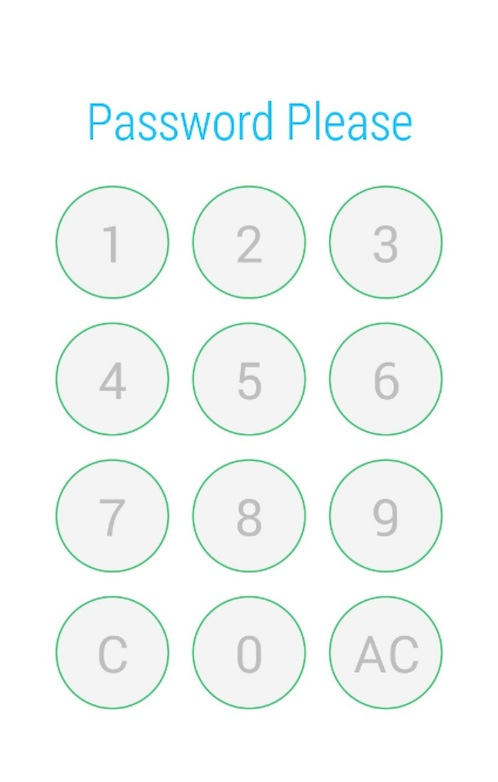

SimpleNumberLock
================

Yeah, one day, I want to build an application to listen the voice of my speaking English teacher who says a lot of English soundmarks.

But i must protect the voice to avoid others who is not student of my teacher, so I add a lock when my app start. But EVERY open-source lock lib is too big and too complex. So I build this.

==============
Notice 

Must use in android 4.0+ (API 14+)

==============
How to import to android studio

yeah, the fxxking android studio, I really waste a lot of time to resolve the problems when the android studio upgrade and I want to import a lib to my project.

I suggest you watch this video  https://www.youtube.com/watch?v=1MyBO9z7ojk

you must add the lib to your project as a library module and put it as your dependence.

then you can use it.

==============
How to use

add the me.wheam.SimpleNumberLock.SimpleNumberLockView in your xml .

And then you can get the instance in your code , and use the SimpleNumberLockView.setPassword() to give your password . There is no “confirm” , so if you type the same sum number , the password will match.

The SimpleNumberLockView.OnFinishListener will callback onSuccess() if input numbers match password, else it will callback onFailed if input error 3 times.

Good luck ! I will improve it after I get a girl friend.
